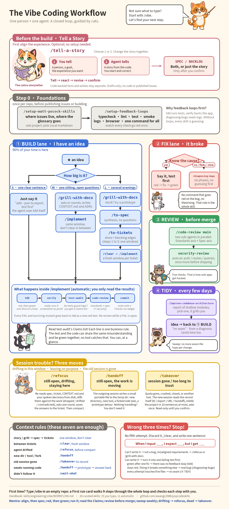

<p align="center">
  
</p>

<h1 align="center">Cat Skills</h1>

<p align="center">
  <strong>A complete vibe-coding workflow for one developer and one agent, taught by cats.</strong><br>
  Works in Claude Code, Codex, Pi, and any agent that reads <code>SKILL.md</code> folders.
</p>

<p align="center">
  <strong>English</strong> | <a href="./README.zh-CN.md">简体中文</a>
</p>

<p align="center">
  <a href="#quick-start">Quick start</a> ·
  <a href="#the-workflow-at-a-glance">The workflow</a> ·
  <a href="#what-cat-skills-does">What it does</a> ·
  <a href="#meet-the-cats">Meet the cats</a> ·
  <a href="#reference">All skills</a>
</p>

---

> **This is a fork of [mattpocock/skills](https://github.com/mattpocock/skills).** The engineering discipline in this repo, and most of the skills in it, are [Matt Pocock's](https://www.aihero.dev) work: the grilling interview, the spec and ticket flow, `tdd`, `code-review`, domain modelling, the deep-module architecture survey, and the conventions that keep a skill small enough to trust. Cat Skills would not exist without them. Thank you, Matt. If you want the original set, his reasoning behind each skill, and updates as he ships them, go to [mattpocock/skills](https://github.com/mattpocock/skills) and [his newsletter](https://www.aihero.dev/s/skills-newsletter).

Cat Skills takes that set and curates and extends it for **solo vibe coding**: you describe what you want, the agent builds it, and the workflow makes sure the agent built the right thing and the codebase is still worth having afterwards.

Vibe coding has two failure modes. The agent builds the wrong thing because it never understood you, and the codebase turns to mud before you notice. Matt's skills fix both, but there are twenty-five of them and you have to know which one to type. Cat Skills adds the missing pieces for one person working alone:

- **`/vibe`**: one command that looks at your repo, puts you on the right lane, and names the exact next thing to type. You never have to remember the map.
- **`/tell-a-story`**: describe a person using your product, or hear a story grounded in the current workspace. Refine the experience together before turning it into a product SPEC or proposed BACKLOG. No requirements-writing expertise needed.
- **A closed loop**: requirements → spec → tickets → tests → running proof → review → commit, with the agent calling each step itself and you reading the results.
- **Session care**: `refocus`, `handoff`, and `takeover` for when the conversation drifts, moves, or dies.
- **`/askcat`**: a cat that explains every installed skill on one HTML page, in plain words, in your language.

All the original skills are still here, unchanged in spirit. Cat Skills is a path through them, plus the skills that path needed and did not have.

## What Cat Skills does

The workflow covers the nine jobs a solo developer keeps doing by hand, and gives each one a skill.

| Job | What used to go wrong | What you type | What the agent does |
| --- | --- | --- | --- |
| **Picture the product** | You know the experience you want but not how to write requirements; the agent guesses the product | `/tell-a-story` | You tell a user story, or the agent tells one from the code; revise it together, confirm it, then choose a product SPEC, proposed BACKLOG, both, or just the story |
| **Talk through the requirement** | You explain once, the agent nods, builds something else | `/grill-with-docs` | Interviews you in rounds until no branch of the design is open; writes the shared vocabulary to `CONTEXT.md` and hard decisions to ADRs |
| **Split it into pieces** | One giant prompt, one giant diff, nothing you can review | `/to-spec` then `/to-tickets` | Synthesises the conversation into a spec with no new questions, then cuts it into tracer-bullet tickets with blocking edges |
| **Write it down and build it** | The spec lives in the chat and evaporates with it | `/implement` | Claims a ticket, drives `tdd` red-then-green one slice at a time, then runs the checks below before it commits |
| **Design the tests that matter to you** | Everything is green and it still doesn't do what you asked; the agent's tests check what it understood, not what you wanted | `/cattytest` | Interviews you from the user's side: what had to be true afterwards, how each existing gate can pass while that's missing, what a person does step by step, what evidence shows the apple is in the basket; writes a test-cases sheet `verify` walks |
| **Prove it works** | "All tests pass" and the app does not boot | automatic: `verify` | Runs the built thing, walks each acceptance criterion as a user would, screenshot or captured output per verdict |
| **Find and fix bugs** | The agent guesses, patches the symptom, breaks something else | say it, or `/diagnosing-bugs` | A bug you understand becomes a failing test first. A bug you do not becomes six gated phases: red loop → minimise → hypothesise → instrument → fix → regression test |
| **Check code quality** | Tests that can never fail, routes without auth, secrets in the bundle | automatic: `test-audit`, `code-review`, `security-review` | Translates every test into a business claim you can read and mutates the code to see if it catches anything; reviews the diff on two axes (standards, spec) in parallel; checks the five security failures solo apps actually ship |
| **Check the architecture** | Every change touches seven files and you stopped noticing | `/improve-codebase-architecture` | Surveys the codebase for shallow modules, hands you an HTML report, grills you through the one you pick, which becomes the next thing you build |

Two more jobs turned out to matter as much as the nine:

| Job | What you type | What the agent does |
| --- | --- | --- |
| **Keep the agent honest in a long session** | `/refocus` | Re-reads the spec, the ticket, and every spoken decision from disk, diffs them against the work, reports what was dropped or drifted, asks one round of questions, writes the answers back |
| **Survive a session ending** | `/handoff` (leaving on purpose) or `/takeover` (the old session is gone) | The outgoing session writes a small portable file; the incoming session rebuilds context from an export, ID, URL, or handoff file and confirms its understanding before touching anything |

## The workflow at a glance

Four lanes, one setup step, and three moves for when a session goes sideways. You are always in exactly one lane. `/vibe` reads this map for you; the full text is in [`skills/engineering/vibe/WORKFLOW.md`](./skills/engineering/vibe/WORKFLOW.md).

<p align="center">
  <a href="./docs/engineering/vibe-workflow-poster.png">
    
  </a>
</p>

<p align="center"><sub>Click for full size. The poster is built by <a href="./docs/engineering/poster/build_poster.py"><code>docs/engineering/poster/build_poster.py</code></a> from the handbook, so it stays exact.</sub></p>

**Step 0, once per repo.** `/setup-matt-pocock-skills` decides where issues live (local Markdown for a solo project, GitHub when you want issues and PRs) and where the glossary goes. `/setup-feedback-loops` wires typecheck, lint, tests, smoke test, logs and browser into one command and proves each one goes red. The build and verification steps spend those loops; without them the agent is guessing.

**Lane 1, Build: I have an idea.** If the product experience is still hard to describe, start with `/tell-a-story`, even before setup. Choose 1 to tell the story or 2 to hear one from the workspace; agree on the experience before planning the build. The optional SPEC and BACKLOG are local product drafts, not published issues.

Once that picture is shared, size the build:

- **S**, one clear sentence: just say it and add "test first". The agent uses `tdd` on its own.
- **M**, one sitting with open questions: `/grill-with-docs` → `/implement`, same window.
- **L**, several evenings: `/grill-with-docs` → `/to-spec` → `/to-tickets` → a fresh window and `/implement` per ticket. A question that needs running code to settle takes the `prototype` detour and folds the answer back into the grill.

**Lane 2, Fix: it broke.** Know the cause? Say it, test first. Don't, or it's flaky or slow? `/diagnosing-bugs`. No command that goes red on the bug, no theorising: that rule is the whole skill.

**Lane 3, Review: before merge or ship.** `/code-review main` runs two sub-agents in parallel, one for standards and one for the spec; `security-review` joins automatically whenever the diff touches auth, routes, queries, env, or dependencies. Run it once more before anything goes on the internet.

**Lane 4, Tidy: every few days.** `/improve-codebase-architecture` finds shallow modules and grills you through one. The result is an idea, and ideas go back to Lane 1.

**Inside `/implement`, automatically:** `tdd` → `verify` → `test-audit` → `code-review` → commit. Every FAIL and every surviving mutant goes back to `tdd` as a new red test. You only read the results, and the one result worth reading closely is `test-audit`'s Claims list: each line is a business rule, and the test and the code can share the same misunderstanding and be green together. No tool catches that. You can, at a glance.

**Wrong three times? Stop.** No fifth attempt. Discard it and write one sentence: *When I input ___, I expect ___, but I get ___*. Can't write it? It's not a bug, the requirement is misaligned: `/refocus` or `/grill-with-docs`. Can write it? Turn it into one failing test first.

**First time here?** Type `/vibe` in an empty repo. It hands back a First run card that walks the whole loop once in nine steps and checks each one with you.

## Quick start

### 1. Get the skills

<details>
<summary><strong>Any agent, from a clone (Claude Code, Codex, Pi)</strong></summary>

```bash
git clone https://github.com/awangs1986/popcodeskills.git
cd popcodeskills
scripts/link-skills.sh
```

This symlinks every skill into `~/.claude/skills`, `~/.agents/skills` and `~/.pi/agent/skills`, so a `git pull` keeps all three current. Every skill is host-neutral: no Claude-only tool names, and each carries the Claude Code frontmatter and the Codex `agents/openai.yaml` side by side. `/clear` and `/compact` in the text mean whatever your agent calls starting a fresh window and compressing the current one.

</details>

<details>
<summary><strong>Codex and other agents, with the skills.sh installer</strong></summary>

```bash
npx skills@latest add awangs1986/popcodeskills
```

Pick the skills you want and which agents to install them on. **Make sure `setup-matt-pocock-skills` and `vibe` are among them.** The files land in your project as ordinary files you own; pull updates when you want them with `npx skills update`.

</details>

<details>
<summary><strong>Claude Code, as a plugin</strong></summary>

This fork is not in the official marketplace. Add it as a marketplace once, then install:

```
/plugin marketplace add awangs1986/popcodeskills
/plugin install cat-skills@awangs1986
```

`claude plugins install mattpocock-skills` (the official listing) is Matt's upstream set without the Cat Skills additions; installing both gives you every upstream skill twice, so pick one.

</details>

### 2. Set up the repo, once

```
/setup-matt-pocock-skills
/setup-feedback-loops
```

The first asks three questions (issue tracker, triage labels, where docs go) and writes an `## Agent skills` block into your `CLAUDE.md` or `AGENTS.md`. The second wires and proves your feedback loops. Both take a few minutes and you do not do them again.

### 3. Type `/vibe`

```
/vibe                       → where you were, and which lane you are in
/vibe add CSV export        → a route card: lane, next command, then what
/tell-a-story               → align the product by telling or hearing a user story
/askcat                     → a cat explains every skill you have installed
```

That is the whole interface. Everything else is something `/vibe` tells you to type when it is time.

## Meet the cats

Seven cats, seven coats, each responsible for a part of the loop. The new calico storyteller guides `/tell-a-story` before engineering begins. Click a cat for the full-size illustration; `/askcat` is the companion web guide to the skills.

<table width="100%">
  <tr>
    <td align="center" width="25%"><a href="./docs/engineering/poster/cats/cat_teacher.png"></a><br><strong>The teacher</strong><br><sub>Ginger & white</sub><br><sub><code>/vibe</code><br><code>/askcat</code></sub></td>
    <td align="center" width="25%"><a href="./docs/engineering/poster/cats/cat_storyteller.png"></a><br><strong>The storyteller</strong><br><sub>Calico</sub><br><sub><code>/tell-a-story</code></sub></td>
    <td align="center" width="25%"><a href="./docs/engineering/poster/cats/cat_clipboard.png"></a><br><strong>The checker</strong><br><sub>Tuxedo</sub><br><sub><code>verify</code><br><code>test-audit</code></sub></td>
    <td align="center" width="25%"><a href="./docs/engineering/poster/cats/cat_detective.png"></a><br><strong>The detective</strong><br><sub>Silver tabby</sub><br><sub><code>diagnosing-bugs</code></sub></td>
  </tr>
</table>

<table width="100%">
  <tr>
    <td align="center" width="33%"><a href="./docs/engineering/poster/cats/cat_shield.png"></a><br><strong>The guard</strong><br><sub>Brown tabby</sub><br><sub><code>code-review</code><br><code>security-review</code></sub></td>
    <td align="center" width="33%"><a href="./docs/engineering/poster/cats/cat_broom.png"></a><br><strong>The sweeper</strong><br><sub>Siamese</sub><br><sub><code>improve-codebase-architecture</code></sub></td>
    <td align="center" width="33%"><a href="./docs/engineering/poster/cats/cat_dizzy.png"></a><br><strong>The one who lost the thread</strong><br><sub>Dilute tortoiseshell</sub><br><sub><code>refocus</code><br><code>handoff</code><br><code>takeover</code></sub></td>
  </tr>
</table>

- **The teacher** knows the map. Type `/vibe` when you do not want to think about which skill comes next, and `/askcat` when you want the whole kit explained on one page in plain words.
- **The calico storyteller** asks who tells the story. Describe your intended experience, or hear a story grounded in the code; revise and confirm it before choosing a SPEC, BACKLOG, or just the story.
- **The checker** does not trust green. `verify` boots the app and walks the acceptance criteria with a screenshot per verdict; `test-audit` rewrites every test as a business claim and mutates the code to see whether the tests notice.
- **The detective** never guesses. `diagnosing-bugs` refuses to theorise until there is a command that goes red on the bug, then works the six phases in order.
- **The guard** reads the diff twice, once for standards and once for the spec, and brings the security checklist whenever the change touches something the internet can reach.
- **The sweeper** comes by every few days. `improve-codebase-architecture` finds the modules where one change means seven file hops and grills you through fixing one.
- **The one who lost the thread** is you, three hours into a session. `refocus` re-reads everything from disk and tells you what drifted; `handoff` packs the work for a move; `takeover` rebuilds it in a new session from whatever record survived.

## What this fork adds

Upstream ships twenty-five skills; this repo ships thirty-five. Everything below is new relative to upstream. Each one is a full skill with its own `SKILL.md`, docs page, and changeset.

| Skill | Why it was missing |
| --- | --- |
| [`vibe`](./skills/engineering/vibe/SKILL.md) | Upstream has `ask-matt`, a router over all twenty-five upstream skills. A solo developer needs a smaller map with a default at every fork, plus a First run card and a "where was I" block for coming back after two weeks |
| [`tell-a-story`](./skills/engineering/tell-a-story/SKILL.md) | A person can describe using a product before they can write its requirements. Two-way storytelling aligns the experience, then turns the confirmed scenes into a product SPEC or proposed BACKLOG without choosing a stack |
| [`setup-feedback-loops`](./skills/engineering/setup-feedback-loops/SKILL.md) | `tdd` runs tests, `verify` boots the app, `diagnosing-bugs` reads logs. Nothing wired those up or proved they could fail |
| [`verify`](./skills/engineering/verify/SKILL.md) | A green suite is not a working app. Someone has to run it and walk the acceptance criteria with evidence |
| [`test-audit`](./skills/engineering/test-audit/SKILL.md) | Agent-written tests pass by construction. Rendering them as business claims and probing with mutants is the only check a non-tester can actually make |
| [`security-review`](./skills/engineering/security-review/SKILL.md) | Solo-built apps ship the same five holes. A conditional third sub-agent of `code-review` |
| [`refocus`](./skills/engineering/refocus/SKILL.md) | Long sessions drift, and `/compact` throws away exactly the decisions that matter. Re-anchor on the primary sources before compacting |
| [`takeover`](./skills/productivity/takeover/SKILL.md) | `handoff` needs the old session to be alive and cooperative. `takeover` is the other end of the bridge: rebuild from an export, ID, URL or handoff file, and confirm before continuing |
| [`askcat`](./skills/productivity/askcat/SKILL.md) | `teach` pointed at the kit itself: one HTML page, every installed skill, plain words, cats |
| [`cattytest`](./skills/engineering/cattytest/SKILL.md) | The gates the agent writes check what it understood; when the understanding is the bug, they all pass. A grilling session from your side of the screen that designs the cases that check what you *wanted*: the apple in the basket, not a green suite |

Also changed across the whole repo:

- **`implement` is a closed chain.** Claim the ticket → `tdd` → `verify` → `test-audit` → `code-review` (+ `security-review`) → commit → close the ticket → a Checks run ledger. Every FAIL and every surviving mutant goes back to `tdd`.
- **Every skill speaks gently and naturally.** A patient, attentive secretary-like manner, with the literal `喵！` at conversational paragraph boundaries. Commands, quotations, tables, and technical artifacts stay exact; evidence and confirmation gates stay strict. The rule travels with each skill and is written into setup output; the [shared conversation policy](./.agents/conversation-style.md) and automated checks prevent drift.
- **Routing and onboarding are checked for omissions.** `/vibe` accounts for every promoted skill and handles stories, guides, and session care before setup; `/askcat` deduplicates actual files and validates cards and picker targets instead of trusting an old count or list.
- **Every skill is host-neutral.** No Claude-only tool names anywhere. Skills say *Invoke the "X" skill*, which is the Skill tool in Claude Code, a skill reference in Codex, and "read that SKILL.md" in Pi or anything else (see [`.agents/invocation.md`](./.agents/invocation.md)).
- **Skills are written in English; the agent answers in your language.** No skill hard-codes an output language. `setup-matt-pocock-skills` writes a Language rule into your `CLAUDE.md` / `AGENTS.md`: reply in the language the user writes in, keep names, commands and paths unchanged.
- **The handbook and the poster.** [`WORKFLOW.md`](./skills/engineering/vibe/WORKFLOW.md) is the long form: the kit, the four lanes, the context rules, git in this workflow, what to do when the project gets big, and two sessions walked end to end. The poster above is the same thing on one page.

## Credits and license

Upstream is [mattpocock/skills](https://github.com/mattpocock/skills) by [Matt Pocock](https://www.aihero.dev), forked at v1.2.3. Twenty-five of the thirty-five skills here are his, kept in spirit and adapted only where the solo workflow or host neutrality needed it; the repo's conventions (`CLAUDE.md`, the docs pages, the changeset flow) are his too. The cats, the `/vibe` workflow, the handbook, the poster, and the ten skills listed under *What this fork adds* were made for this repo.

MIT licensed, same as upstream. The original copyright notice is kept in [`LICENSE`](./LICENSE). Askcat's embedded two-glyph marker font is derived from Noto Sans SC and retains its [SIL OFL 1.1 license](./skills/productivity/askcat/assets/OFL.txt), also included in generated HTML.

## Reference

These split on one axis: who can invoke them. **User-invoked** skills are reachable only when you type them (e.g. `/grill-me`); their job is to orchestrate. **Model-invoked** skills can be invoked by you _or_ reached for automatically by the agent when the task fits; they hold the reusable discipline. A user-invoked skill may invoke model-invoked skills, but never another user-invoked one.

### Engineering

Skills I use daily for code work.

**User-invoked**

- **[ask-matt](./skills/engineering/ask-matt/SKILL.md)**: Ask which skill or flow fits your situation. A router over the user-invoked skills in this repo.
- **[vibe](./skills/engineering/vibe/SKILL.md)**: Solo developer's dispatcher: puts you on one of four lanes (build, fix, review, tidy), sizes the work, and names the exact next command. A curated subset of the map for one person working alone.
- **[tell-a-story](./skills/engineering/tell-a-story/SKILL.md)**: Align the product through a user-told or source-grounded story, revise it together, then turn the confirmed experience into a product SPEC or proposed BACKLOG. No coding or issue publication.
- **[refocus](./skills/engineering/refocus/SKILL.md)**: Re-anchor a long session on its requirements: re-read the spec, ticket, and every decision from its primary source, check what has actually been built against them, report the drift, and ask one round of questions about anything the sources leave ambiguous before continuing.
- **[grill-with-docs](./skills/engineering/grill-with-docs/SKILL.md)**: Grilling session that also builds your project's domain model, sharpening terminology and updating `CONTEXT.md` and ADRs inline.
- **[triage](./skills/engineering/triage/SKILL.md)**: Move issues through a state machine of triage roles.
- **[improve-codebase-architecture](./skills/engineering/improve-codebase-architecture/SKILL.md)**: Scan a codebase for deepening opportunities, present them as a visual HTML report, then grill through whichever one you pick.
- **[setup-matt-pocock-skills](./skills/engineering/setup-matt-pocock-skills/SKILL.md)**: Configure this repo for the engineering skills (issue tracker, triage labels, domain doc layout). Run once per repo before using the other engineering skills.
- **[setup-feedback-loops](./skills/engineering/setup-feedback-loops/SKILL.md)**: Audit and wire the feedback loops the other skills spend (typecheck, lint, tests, formatter, smoke test, dev logs, browser, pre-commit guardrail), prove each one goes red, and record the commands in `docs/agents/feedback-loops.md`. Run once per repo, again when the stack changes.
- **[to-spec](./skills/engineering/to-spec/SKILL.md)**: Turn the current conversation into a spec and publish it to the issue tracker. No interview, just synthesizes what you've already discussed.
- **[to-tickets](./skills/engineering/to-tickets/SKILL.md)**: Break any plan, spec, or conversation into a set of tracer-bullet tickets, each declaring its blocking edges, written as text in a local file, or as native blocking links on a real tracker.
- **[implement](./skills/engineering/implement/SKILL.md)**: Build the work described by a spec or set of tickets, driving `/tdd` at pre-agreed seams, running `/verify` and `/test-audit` once green, and closing out with `/code-review` and a Checks run ledger before committing.
- **[cattytest](./skills/engineering/cattytest/SKILL.md)**: Design the test cases that prove the software did what you wanted, from your side of the screen: what a person does, with what data, and what must be true in the world afterwards. Not the agent's gates. Ends in a test-cases sheet `verify` walks and you can run by hand.
- **[wayfinder](./skills/engineering/wayfinder/SKILL.md)**: Plan a huge chunk of work, more than one agent session can hold, as a shared map of decision tickets on the issue tracker, and resolve them one at a time until the way to the destination is clear.

**Model-invoked**

- **[prototype](./skills/engineering/prototype/SKILL.md)**: Build a throwaway prototype to answer a design question, either a single shareable HTML file for state/logic questions, or several radically different UI variations toggleable from one route.
- **[diagnosing-bugs](./skills/engineering/diagnosing-bugs/SKILL.md)**: Disciplined diagnosis loop for hard bugs and performance regressions: build a feedback loop that goes red on this bug → minimise → hypothesise → instrument → fix → regression-test.
- **[research](./skills/engineering/research/SKILL.md)**: Investigate a question against high-trust primary sources and capture the findings as a cited Markdown file in the repo, run as a background agent.
- **[tdd](./skills/engineering/tdd/SKILL.md)**: Test-driven development with a red-green-refactor loop. Builds features or fixes bugs one vertical slice at a time.
- **[domain-modeling](./skills/engineering/domain-modeling/SKILL.md)**: Actively build and sharpen a project's domain model: challenge terms against the glossary, stress-test with edge-case scenarios, and update `CONTEXT.md` and ADRs inline.
- **[codebase-design](./skills/engineering/codebase-design/SKILL.md)**: Shared discipline and vocabulary for designing deep modules: a lot of behaviour behind a small interface, placed at a clean seam, testable through that interface.
- **[verify](./skills/engineering/verify/SKILL.md)**: Run the built thing and walk its acceptance criteria and user stories as a user would, one wrong path each, with a screenshot or captured output per verdict. Observes, never fixes; `implement` calls it after the suite is green.
- **[security-review](./skills/engineering/security-review/SKILL.md)**: Check a diff for the five security failures solo-built apps actually ship: secrets in the bundle, routes without per-record authorisation, unvalidated input, data access that bypasses RLS, unaudited dependencies. A conditional third sub-agent of `code-review`.
- **[test-audit](./skills/engineering/test-audit/SKILL.md)**: Do the tests behind a change protect the business logic or only pass? Translates each test into a plain-language claim the domain expert can judge, maps claims to the acceptance criteria, and runs a targeted mutation probe. `implement` calls it after `verify`.
- **[code-review](./skills/engineering/code-review/SKILL.md)**: Two-axis review of the diff since a fixed point: **Standards** (does it follow the repo's coding standards, plus a Fowler smell baseline?) and **Spec** (does it faithfully implement the originating issue/spec?), run as parallel sub-agents so neither pollutes the other.
- **[resolving-merge-conflicts](./skills/engineering/resolving-merge-conflicts/SKILL.md)**: Work through an in-progress git merge or rebase conflict hunk by hunk, resolving by intent traced to each side's primary source, then finish the operation (never `--abort`).
- **[wizard](./skills/engineering/wizard/SKILL.md)**: Generate an interactive bash wizard that walks a human through steps only they can perform: provisioning infrastructure, setting up credentials or CI secrets, walking an unfamiliar third-party dashboard, or running a one-off migration or cutover.

### Productivity

General workflow tools, not code-specific.

**User-invoked**

- **[askcat](./skills/productivity/askcat/SKILL.md)**: Build one HTML page where a cartoon cat explains every installed skill in plain words: what it does, when to type it, what a good run looks like, plus a "which one do I need?" picker and a first-run checklist. In your language.
- **[grill-me](./skills/productivity/grill-me/SKILL.md)**: Talk through a plan or design in patient, thorough rounds until every branch of the design tree is resolved.
- **[handoff](./skills/productivity/handoff/SKILL.md)**: Compact the current conversation into a handoff document so another agent can continue the work.
- **[takeover](./skills/productivity/takeover/SKILL.md)**: Resume a long or stalled conversation in a fresh session from an ID, export, URL, or handoff file: the new session indexes the records, rebuilds concise context, describes the project in up to ten sentences, and confirms before continuing. Needs nothing from the old session.
- **[teach](./skills/productivity/teach/SKILL.md)**: Teach the user a new skill or concept over multiple sessions, using the current directory as a stateful teaching workspace.
- **[to-questionnaire](./skills/productivity/to-questionnaire/SKILL.md)**: Turn a decision you can't answer alone into a Markdown questionnaire for the one person who can, filled in async, or together over a meeting. It grills you about the send (who it's for, what you need back), not the subject.
- **[wait-what](./skills/productivity/wait-what/SKILL.md)**: Fire this the moment a message doesn't land. The agent re-pitches it with the context you're missing, in plain words, in your language, using your `CONTEXT.md` vocabulary.

**Model-invoked**

- **[grilling](./skills/productivity/grilling/SKILL.md)**: Interview the user patiently and thoroughly about a plan, decision, or idea until every branch of the design tree is resolved. The reusable interview primitive behind `grill-me`, `grill-with-docs`, `triage`, `wayfinder` and `improve-codebase-architecture`.
- **[writing-for-agents](./skills/productivity/writing-for-agents/SKILL.md)**: Writing documents for agents: skills, AGENTS.md/CLAUDE.md, and any doc an agent reaches by a pointer.
