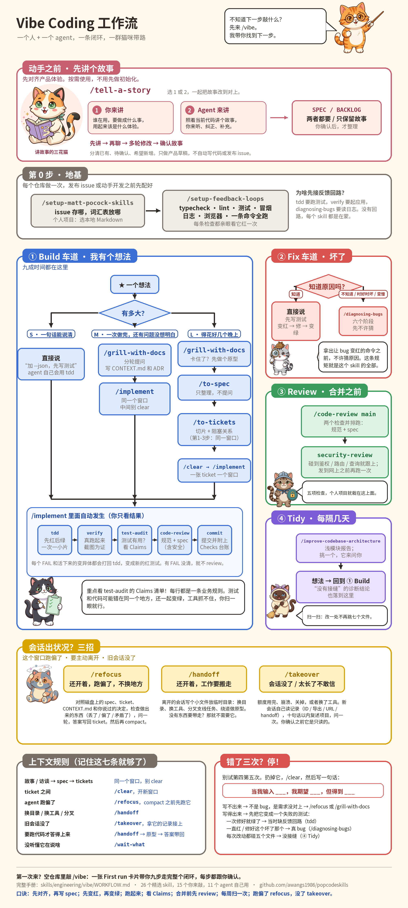
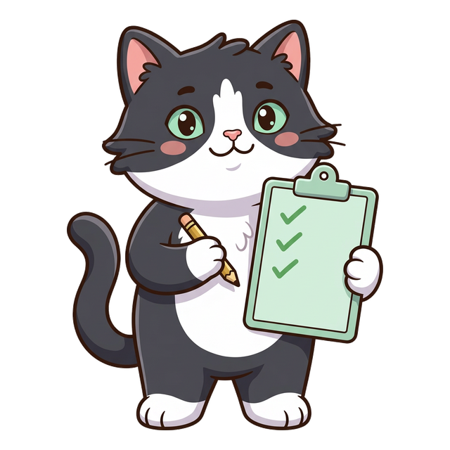

<p align="center">
  
</p>

<h1 align="center">猫咪 Skills</h1>

<p align="center">
  <strong>一个人、一个 agent 的完整 vibe coding 工作流，有猫带着你走。</strong><br>
  Claude Code、Codex、Pi 都能用，任何认得 <code>SKILL.md</code> 目录的 agent 也行。
</p>

<p align="center">
  <a href="./README.md">English</a> | <strong>简体中文</strong>
</p>

<p align="center">
  <a href="#快速开始">快速开始</a> ·
  <a href="#工作流一览">工作流</a> ·
  <a href="#猫咪-skills-做什么">有啥用</a> ·
  <a href="#认识这些猫">认识这些猫</a> ·
  <a href="#参考全部-skill">全部 skill</a>
</p>

---

> **这个项目 fork 自 [mattpocock/skills](https://github.com/mattpocock/skills)。** 这里的工程规矩，还有里面大部分 skill，都是 [Matt Pocock](https://www.aihero.dev) 写的：grilling 访谈、spec 和 ticket 那套流程、`tdd`、`code-review`、领域建模、深模块架构巡检，以及那套"一个 skill 就该小到让人敢信"的写法。没有这些，就没有猫咪 Skills。谢谢 Matt。想要原版 skill、他写每个 skill 时的想法，还有他后面更新的东西，去 [mattpocock/skills](https://github.com/mattpocock/skills) 和[他的 newsletter](https://www.aihero.dev/s/skills-newsletter)。

猫咪 Skills 把这套 skill 挑了一遍，又补了几块，专门给**一个人 vibe coding**用：你说想要啥，agent 去做，工作流负责盯着两件事，agent 做的东西是你想要的，做完之后代码库还没烂。

vibe coding 翻车一般就两种：agent 压根没听懂，做出来个别的；代码库在你发现之前已经烂成一锅粥。Matt 的 skill 两种都能治，问题是一共二十五个，你得自己知道这会儿该敲哪个。猫咪 Skills 补的就是一个人单干时最缺的几块：

- **`/vibe`**：一条命令解决"我现在该干啥"。它看一眼你的仓库，告诉你走哪条道，下一步敲哪条命令。你不用背整张地图。
- **`/tell-a-story`**：讲一个真人怎样使用产品的故事，或者听 agent 照着当前工作区讲。一起改到体验对上，再整理成产品 SPEC 或待办 BACKLOG。不用先学会写专业需求。
- **一条闭环**：需求 → spec → tickets → 测试 → 跑起来的证据 → 审查 → 提交。agent 自己一步步往下走，你只管看结果。
- **会话兜底**：`refocus`、`handoff`、`takeover`。聊偏了、要换地方、会话直接没了，都有招。
- **`/askcat`**：一只猫在一个 HTML 页面上，把你装的每个 skill 用大白话讲一遍，说的是你的话。

原来的 skill 都在，用法没变。猫咪 Skills 就是一条穿过它们的路，外加这条路上缺的那几个 skill。

## 猫咪 Skills 做什么

一个人写代码，那些反复出现的累活有九件，每件配一个 skill。

| 事情 | 以前哪里出错 | 你敲什么 | agent 做什么 |
| --- | --- | --- | --- |
| **把产品想明白** | 知道想要什么体验，却不会写需求；agent 只好猜产品该长什么样 | `/tell-a-story` | 你讲用户故事，或者 agent 照着代码讲；一起修改、确认，再选产品 SPEC、待办 BACKLOG、两者都要，或者只保留故事 |
| **把需求聊清楚** | 你讲一遍，agent 点头说懂了，做出来是另一个东西 | `/grill-with-docs` | 一轮一轮追问，问到每个岔路都有了答案；约定的词记进 `CONTEXT.md`，不好改的决定写成 ADR |
| **拆成小块** | 一个巨型 prompt 带出一个巨型 diff，根本没法审 | `/to-spec` 然后 `/to-tickets` | 先把聊过的内容整理成 spec，一个新问题都不问；再切成一串 tracer-bullet tickets，每张写清楚卡在哪张后面 |
| **写下来再动手** | spec 只活在聊天记录里，窗口一关就没 | `/implement` | 领一张 ticket，用 `tdd` 先红后绿，一次只做一小片；提交之前把下面的检查全跑完 |
| **测你真正想要的东西** | 全绿了，但做的根本不是你要的：agent 的测试只能证明它"听懂了"，证明不了你"要的是这个" | `/cattytest` | 站在你这边问：做完之后啥必须成立、现有检查为啥全绿了还能漏掉它、一个真人会一步步干啥、啥证据能证明苹果在篮子里；最后交出一张 `verify` 照着走的测试表 |
| **证明真能跑** | "测试全过"，应用起都起不来 | 自动跑：`verify` | 把东西真跑起来，像用户一样把验收标准走一遍，每条结论都附截图或抓到的输出 |
| **找 bug，修 bug** | agent 靠猜，糊住表面，顺手弄坏别处 | 直接说，或者 `/diagnosing-bugs` | 知道原因的 bug，先写个失败的测试再修。吃不准的 bug，走六步，一步一过关：复现变红 → 缩小范围 → 列假设 → 加日志 → 修 → 回归测试 |
| **看代码质量** | 永远失败不了的测试、没鉴权的路由、打进包里的密钥 | 自动跑：`test-audit`、`code-review`、`security-review` | 每个测试翻译成一句你看得懂的业务话，再故意改坏代码，看测试能不能发现；从规范和 spec 两个角度并排审 diff；专查个人项目上线时最常见的五种安全漏洞 |
| **看架构** | 改一处要碰七个文件，你都习惯了 | `/improve-codebase-architecture` | 把代码库扫一遍，找出浅模块，给你一份 HTML 报告；你挑一个，它追着你问到底，这个就是你下一件要做的事 |

除了这九件，后来发现还有两件一样重要的事：

| 事情 | 你敲什么 | agent 做什么 |
| --- | --- | --- |
| **长会话别跑偏** | `/refocus` | 把 spec、ticket 和你亲口定的每个决定重新读一遍，跟做出来的东西对照：丢了啥，偏了啥；不清楚的问一轮，答案写回去 |
| **会话没了也不丢活** | `/handoff`(主动走)或 `/takeover`(旧会话没了) | 要走的会话留一个小文件；接手的会话拿着导出、ID、URL 或 handoff 文件把上下文找回来，动手之前先跟你对一遍 |

## 工作流一览

四条车道，一次初始化，外加会话出状况时的三招。你在任何时候都只走一条道。`/vibe` 帮你看地图；完整文字版在 [`skills/engineering/vibe/WORKFLOW.md`](./skills/engineering/vibe/WORKFLOW.md)。

<p align="center">
  <a href="./docs/engineering/vibe-workflow-poster.zh-CN.png">
    
  </a>
</p>

<p align="center"><sub>点开看大图。海报是 <a href="./docs/engineering/poster/build_poster_zh.py"><code>docs/engineering/poster/build_poster_zh.py</code></a> 照着手册画出来的，跟手册永远一致。</sub></p>

**第 0 步，每个仓库做一次。** `/setup-matt-pocock-skills` 定两件事：issue 存哪(个人项目用本地 Markdown，想用 issue 和 PR 就用 GitHub)，词汇表存哪。`/setup-feedback-loops` 把 typecheck、lint、测试、冒烟测试、日志和浏览器串成一条命令，每条都亲手弄红一次给你看。开发和验证环节全指着这些回路干活；没有它们，agent 就是在蒙。

**车道 1，Build：我有个想法。** 如果还说不清产品用起来该是什么体验，先 `/tell-a-story`，没初始化也能用。选 1 由你讲故事，选 2 听 agent 照着工作区讲；先对齐体验，再规划开发。可选的 SPEC 和 BACKLOG 是本地产品草稿，不是已经发布的 issue。

产品画面对齐了，再掂掂开发的分量：

- **S**，一句话说得清：直接说，再加一句"先写测试"。agent 自己会用 `tdd`。
- **M**，一次能干完，但还有些问题没想明白：`/grill-with-docs` → `/implement`，别换窗口。
- **L**，得花好几个晚上：`/grill-with-docs` → `/to-spec` → `/to-tickets` → 每张 ticket 开个新窗口 `/implement`。有些问题不跑代码回答不了，那就绕去 `prototype` 跑一下，把答案带回访谈里。

**车道 2，Fix：坏了。** 知道为啥坏？直接说，先写测试。不知道，或者时好时坏，或者变慢了？`/diagnosing-bugs`。规矩只有一条：拿出能让这个 bug 变红的命令之前，不许瞎猜。这个 skill 就这条规矩。

**车道 3，Review：合并或者上线之前。** `/code-review main` 叫两个检查并排跑，一个看规范，一个看 spec；diff 只要碰到鉴权、路由、查询、环境变量、依赖，`security-review` 自动跟上。东西放到网上之前，再跑一遍。

**车道 4，Tidy：隔几天来一次。** `/improve-codebase-architecture` 把浅模块找出来，揪着其中一个问你。问完会落成一个想法，想法回车道 1。

**`/implement` 里面全自动：** `tdd` → `verify` → `test-audit` → `code-review` → 提交。每个 FAIL、每个没被测出来的变异体，都会变成新的红测试打回 `tdd`。你只管看结果，其中最值得细看的是 `test-audit` 的 Claims 清单：每行都是一条业务规则。测试和代码可能错在同一个地方，还一起变绿，工具发现不了，你扫一眼就能看出来。

**错了三次就停。** 别试第四第五次。扔掉，写一句话：*当我输入 ___，我期望 ___，但得到 ___*。写不出来？那不是 bug，是需求没对上：`/refocus` 或者 `/grill-with-docs`。写得出来？先把它变成一个失败的测试。

**第一次来？** 空仓库里敲 `/vibe`。它给你一张 First run 卡片，九步带你把闭环走一遍，每步都跟你对一下。

## 快速开始

### 1. 拿到 skill

<details>
<summary><strong>直接 clone，哪个 agent 都行(Claude Code、Codex、Pi)</strong></summary>

```bash
git clone https://github.com/awangs1986/popcodeskills.git
cd popcodeskills
scripts/link-skills.sh
```

这一步给每个 skill 建软链，连到 `~/.claude/skills`、`~/.agents/skills` 和 `~/.pi/agent/skills`，以后 `git pull` 一下拉三处全更新。每个 skill 都不挑 agent：没有 Claude 专属的工具名，Claude Code 的 frontmatter 和 Codex 的 `agents/openai.yaml` 都带着。文里的 `/clear` 和 `/compact`，就是你的 agent 里"开新窗口"和"压缩当前会话"，名字可能不一样。

</details>

<details>
<summary><strong>Codex 这些 agent 可以用 skills.sh 装</strong></summary>

```bash
npx skills@latest add awangs1986/popcodeskills
```

挑你要的 skill，再挑装到哪个 agent 上。**`setup-matt-pocock-skills` 和 `vibe` 一定要装。** 文件直接放进你的项目，就是普通文件；想更新跑 `npx skills update`。

</details>

<details>
<summary><strong>Claude Code 可以当插件装</strong></summary>

这个 fork 没进官方市场。先把它加成一个市场，再装：

```
/plugin marketplace add awangs1986/popcodeskills
/plugin install cat-skills@awangs1986
```

`claude plugins install mattpocock-skills`(官方那个)装的是 Matt 的原版，没有猫咪 Skills 加的东西；两个都装，上游 skill 会出现两遍，二选一就行。

</details>

### 2. 初始化仓库，只做一次

```
/setup-matt-pocock-skills
/setup-feedback-loops
```

第一条问三个问题(issue 存哪、分诊标签、文档放哪)，然后往你的 `CLAUDE.md` 或 `AGENTS.md` 里加一段 `## Agent skills`。第二条把反馈回路接好，每条都证明真能报警。两条加起来几分钟，做一次就行。

### 3. 敲 `/vibe`

```
/vibe                       → 上次做到哪，现在走哪条道
/vibe add CSV export        → 一张路线卡：车道、下一条命令、然后干啥
/tell-a-story               → 你讲或听用户故事，把产品体验对齐
/askcat                     → 一只猫把装好的 skill 全讲一遍
```

要记的就这几行。别的命令，`/vibe` 会在该用的时候告诉你。

## 认识这些猫

七只猫，七种花色，各管闭环里的一摊。新增的三花猫负责 `/tell-a-story`，先把产品体验讲明白。点击猫咪可以看大图；`/askcat` 则把整套 skill 讲成一个网页导览。

<table width="100%">
  <tr>
    <td align="center" width="25%"><a href="./docs/engineering/poster/cats/cat_teacher.png"></a><br><strong>老师</strong><br><sub>橘白</sub><br><sub><code>/vibe</code><br><code>/askcat</code></sub></td>
    <td align="center" width="25%"><a href="./docs/engineering/poster/cats/cat_storyteller.png"></a><br><strong>讲故事的</strong><br><sub>三花</sub><br><sub><code>/tell-a-story</code></sub></td>
    <td align="center" width="25%"><a href="./docs/engineering/poster/cats/cat_clipboard.png"></a><br><strong>检查员</strong><br><sub>黑白奶牛</sub><br><sub><code>verify</code><br><code>test-audit</code></sub></td>
    <td align="center" width="25%"><a href="./docs/engineering/poster/cats/cat_detective.png"></a><br><strong>侦探</strong><br><sub>银灰虎斑</sub><br><sub><code>diagnosing-bugs</code></sub></td>
  </tr>
</table>

<table width="100%">
  <tr>
    <td align="center" width="33%"><a href="./docs/engineering/poster/cats/cat_shield.png"></a><br><strong>卫士</strong><br><sub>棕虎斑</sub><br><sub><code>code-review</code><br><code>security-review</code></sub></td>
    <td align="center" width="33%"><a href="./docs/engineering/poster/cats/cat_broom.png"></a><br><strong>清扫工</strong><br><sub>暹罗</sub><br><sub><code>improve-codebase-architecture</code></sub></td>
    <td align="center" width="33%"><a href="./docs/engineering/poster/cats/cat_dizzy.png"></a><br><strong>找不着北的</strong><br><sub>浅色玳瑁</sub><br><sub><code>refocus</code><br><code>handoff</code><br><code>takeover</code></sub></td>
  </tr>
</table>

- **老师**认路。不想动脑子就敲 `/vibe`；想一页看懂整套东西就敲 `/askcat`。
- **讲故事的三花猫**先问谁来讲。你可以描述想要的使用体验，也可以听 agent 照着代码讲；多轮修改、确认后，再选 SPEC、BACKLOG，或者只留下故事。
- **检查员**不信绿色。`verify` 把应用跑起来，一条条过验收，每条结论一张截图；`test-audit` 把测试翻译成业务话，再故意改坏代码，看测试是真报警还是装睡。
- **侦探**不瞎猜。`diagnosing-bugs` 拿不到变红的命令就不开口，拿到了才按六步往下走。
- **卫士**把 diff 看两遍，一遍看规范，一遍看 spec；改动碰到网上够得着的地方，就把安全清单带上。
- **清扫工**隔几天来一趟。`improve-codebase-architecture` 专门找"改一处跳七个文件"的模块，揪一个出来跟你一起修。
- **找不着北的那只**就是连聊三小时之后的你。`refocus` 把东西重新读一遍，告诉你偏哪了；`handoff` 帮你打包带走；`takeover` 在新会话里拿残存的记录把上下文拼回来。

## 这个分支新增了什么

上游二十五个 skill，这里三十五个。下面这些上游都没有，每个都有完整的 `SKILL.md`、文档页和 changeset。

| Skill | 为什么原来缺它 |
| --- | --- |
| [`vibe`](./skills/engineering/vibe/SKILL.md) | 上游有个 `ask-matt`，二十五个 skill 全覆盖的路由器。一个人用不了那么多，这里换成一张小地图：每个岔路都有默认走法，再加一张 First run 卡片，和一段"隔两周回来，上次做到哪" |
| [`tell-a-story`](./skills/engineering/tell-a-story/SKILL.md) | 不会写专业需求，也能讲一个人怎么使用产品的故事。双向讲故事先对齐体验，再把确认过的场景转成产品 SPEC 或待办 BACKLOG，不急着选技术栈 |
| [`setup-feedback-loops`](./skills/engineering/setup-feedback-loops/SKILL.md) | `tdd` 要跑测试，`verify` 要起应用，`diagnosing-bugs` 要读日志。原来没人管这些东西接没接好，更没人证明它们真会报警 |
| [`verify`](./skills/engineering/verify/SKILL.md) | 测试全绿，应用不一定能用。总得有人把它跑起来，拿着证据一条条对验收标准 |
| [`test-audit`](./skills/engineering/test-audit/SKILL.md) | agent 写的测试，写出来就是过的。翻译成业务话、再拿变异体去捅一捅，是不懂测试的人唯一能做的检查 |
| [`security-review`](./skills/engineering/security-review/SKILL.md) | 个人项目上线，翻来覆去就是那五个安全坑。它是 `code-review` 里按条件触发的第三个检查 |
| [`refocus`](./skills/engineering/refocus/SKILL.md) | 长会话会跑偏，`/compact` 一压，丢的偏偏是最要紧的决定。压缩之前，先对照原始材料把共识找回来 |
| [`takeover`](./skills/productivity/takeover/SKILL.md) | `handoff` 指望旧会话还活着、还配合。`takeover` 是另一头：拿着导出、ID、URL 或 handoff 文件也能接上，对完再动手 |
| [`askcat`](./skills/productivity/askcat/SKILL.md) | 拿 `teach` 来讲这套 skill 自己：一个 HTML 页面，装了的 skill 全在里面，大白话，有猫 |
| [`cattytest`](./skills/engineering/cattytest/SKILL.md) | agent 设的检查，查的都是它*以为*的东西；它理解错了，检查照样全绿。这场访谈站在你这边，专门设计查你*想要*的东西：苹果在没在篮子里，而不是测试绿没绿 |

另外还有几处整个仓库通用的改动：

- **`implement` 是一条闭环链。** 领 ticket → `tdd` → `verify` → `test-audit` → `code-review`(加 `security-review`)→ 提交 → 关 ticket → 一份 Checks run 台账。每个 FAIL、每个活下来的变异体都打回 `tdd`。
- **所有 Skill 都用温柔、自然的口吻。** 像一位耐心、细心的女秘书，少些机械感；对话的每段末尾带一个“喵！”。代码、命令、引用、表格和正式产物保持原样，验收和确认也不会放松。规则随每个 Skill 独立安装，并写入初始化配置；[统一语气规范](./.agents/conversation-style.md) 和自动校验负责防止漏掉。
- **路由和导览会检查是否漏项。** `/vibe` 逐项覆盖正式 Skill，不把讲故事、导览或会话恢复拦在初始化之前；`/askcat` 按实际文件去重，核对卡片和选择器，不再依赖旧数量或固定清单。
- **每个 skill 都不挑 agent(宿主中立)。** 到处都没有 Claude 专属的工具名。skill 里写的都是 *Invoke the "X" skill*：Claude Code 里是 Skill 工具，Codex 里是 skill 引用，Pi 这些里就是"去读那个 SKILL.md"(见 [`.agents/invocation.md`](./.agents/invocation.md))。
- **skill 用英文写，agent 用你的话回。** 没有 skill 写死输出语言。`setup-matt-pocock-skills` 会往你的 `CLAUDE.md` / `AGENTS.md` 里加一条语言规矩：用户说啥话就回啥话，名字、命令、路径不动。
- **手册和海报。** [`WORKFLOW.md`](./skills/engineering/vibe/WORKFLOW.md) 是完整版：整套 skill、四条车道、上下文规矩、这套流程里的 git、项目长大了咋办，外加两个从头到尾的例子。上面的海报是同一份东西的一页纸版。

## 致谢与许可

上游是 [Matt Pocock](https://www.aihero.dev) 的 [mattpocock/skills](https://github.com/mattpocock/skills)，从 v1.2.3 fork 出来。这里三十五个 skill 里有二十五个是他的，用法原意都没动，只在单人流程和不挑 agent 这两处需要的地方改了改；仓库的规矩(`CLAUDE.md`、文档页、changeset 流程)也是他的。猫、`/vibe` 工作流、手册、海报，还有*这个分支新增了什么*里那十个 skill，是这个仓库自己加的。

MIT 许可，跟上游一样。原来的版权声明还在 [`LICENSE`](./LICENSE) 里。 Askcat 内嵌的两字形语气词字体来自 Noto Sans SC，保留 [SIL OFL 1.1 许可](./skills/productivity/askcat/assets/OFL.txt)，生成的 HTML 里也附有该许可。

## 参考：全部 skill

只按一个标准分：谁能叫它。**用户调用**的 skill，你敲了才动(比如 `/grill-me`)，负责串流程。**模型调用**的 skill，你能敲，agent 碰到合适的活也会自己用，里面是反复用的固定做法。用户调用的 skill 能叫模型调用的 skill，但不能叫另一个用户调用的 skill。

skill 本身英文写的，下面是中文说明，名字命令跟英文版一样。

### 工程（Engineering）

天天写代码用的 skill。

**用户调用**

- **[ask-matt](./skills/engineering/ask-matt/SKILL.md)**：拿不准用哪个 skill、走哪条流程，就问它。管着仓库里所有能敲的 skill 的路由器。
- **[vibe](./skills/engineering/vibe/SKILL.md)**：一个人的调度：看你走四条道里的哪条(build、fix、review、tidy)，活有多大，下一条敲啥。整张地图里专给一个人挑出来的那部分。
- **[tell-a-story](./skills/engineering/tell-a-story/SKILL.md)**：你讲想要的使用体验，或 agent 照着代码讲当前体验；多轮修改、确认后，转成产品 SPEC 或待办 BACKLOG。不写代码，不自动发布 issue。
- **[refocus](./skills/engineering/refocus/SKILL.md)**：长会话跑偏了，把它拉回来：spec、ticket、每个决定对照原始材料重读一遍，看做出来的东西对不对得上，偏了就报出来，材料里没写清的问一轮再接着干。
- **[grill-with-docs](./skills/engineering/grill-with-docs/SKILL.md)**：边访谈边建领域模型：术语当场磨，`CONTEXT.md` 和 ADR 当场记。
- **[triage](./skills/engineering/triage/SKILL.md)**：issue 按分诊角色的状态机往下走。
- **[improve-codebase-architecture](./skills/engineering/improve-codebase-architecture/SKILL.md)**：扫一遍代码库，找值得加深的模块，出一份看得懂的 HTML 报告，你挑一个，它追着你问到底。
- **[setup-matt-pocock-skills](./skills/engineering/setup-matt-pocock-skills/SKILL.md)**：给工程 skill 安家：issue 存哪、分诊标签、领域文档咋放。用别的工程 skill 之前，每个仓库跑一次。
- **[setup-feedback-loops](./skills/engineering/setup-feedback-loops/SKILL.md)**：把别的 skill 要用的反馈回路(typecheck、lint、测试、格式化、冒烟测试、开发日志、浏览器、pre-commit 门禁)接好，每条都亲手弄红一次，命令记到 `docs/agents/feedback-loops.md`。每个仓库跑一次，换技术栈再跑。
- **[to-spec](./skills/engineering/to-spec/SKILL.md)**：把当前聊的内容整理成 spec，发到 issue tracker。不提问，只整理已经聊过的。
- **[to-tickets](./skills/engineering/to-tickets/SKILL.md)**：计划、spec、聊天记录都行，拆成一串 tracer-bullet tickets，每张写清楚卡在哪张后面；写本地文件里，或者挂 tracker 原生阻塞链接上。
- **[implement](./skills/engineering/implement/SKILL.md)**：照着 spec 或一串 ticket 干活：事先说好的接缝上跑 `/tdd`，绿了跑 `/verify` 和 `/test-audit`，最后 `/code-review` 加一份 Checks run 台账收尾，再提交。
- **[cattytest](./skills/engineering/cattytest/SKILL.md)**：站在你这边设计测试，证明软件干的是你想要的事：真人做啥操作、拿啥数据、完事之后世界上啥必须成立。跟 agent 自己的门禁两码事。最后交一张测试表，`verify` 照着走，你自己上手跑也行。
- **[wayfinder](./skills/engineering/wayfinder/SKILL.md)**：活太大，一个会话装不下：先在 issue tracker 上铺一张决策 ticket 的地图，一个一个解，解到去目的地的路清楚为止。

**模型调用**

- **[prototype](./skills/engineering/prototype/SKILL.md)**：拿一次性的原型回答设计问题：状态逻辑问题给一个能点的 HTML 单文件，UI 问题给同一路由下几个长得完全不一样的版本随便切。
- **[diagnosing-bugs](./skills/engineering/diagnosing-bugs/SKILL.md)**：专治难缠 bug 和性能倒退，固定六步：先造一条碰到这个 bug 就变红的命令 → 缩小范围 → 列假设 → 加日志 → 修 → 回归测试。
- **[research](./skills/engineering/research/SKILL.md)**：碰到要查真凭实据的问题(库、API)，对照一手来源查，后台跑，结论写成带引用的 Markdown 存仓库里。
- **[tdd](./skills/engineering/tdd/SKILL.md)**：红绿重构的测试驱动：做功能、修 bug，一次只切一小片。
- **[domain-modeling](./skills/engineering/domain-modeling/SKILL.md)**：主动打磨领域模型：术语拿词汇表较真，边界情况往死里试，`CONTEXT.md` 和 ADR 当场更新。
- **[codebase-design](./skills/engineering/codebase-design/SKILL.md)**：设计深模块的共用做法和说法：接口小，里面藏的活多，放在干净的接缝上，对着接口就能测。
- **[verify](./skills/engineering/verify/SKILL.md)**：把东西跑起来，像用户一样把验收标准和用户故事走一遍，每条顺手走个错路，每条结论配截图或抓到的输出。只看不动手；`implement` 测试全绿之后叫它。
- **[security-review](./skills/engineering/security-review/SKILL.md)**：专查个人项目最容易带上线的五种安全问题：打进包里的密钥、没按记录做鉴权的路由、没验过的输入、绕过 RLS 的数据访问、没审计过的依赖。`code-review` 里按条件触发的第三个检查。
- **[test-audit](./skills/engineering/test-audit/SKILL.md)**：这次改动的测试，是真在保护业务逻辑，还是只会绿？每条测试翻译成懂业务的人看得懂的大白话，挨个对到验收标准上，再故意改坏几处逻辑看测试叫不叫。`implement` 跑完 `verify` 就叫它。
- **[code-review](./skills/engineering/code-review/SKILL.md)**：从某个固定点开始的 diff，从规范和 spec 两个角度审：**规范**(守没守仓库的编码规矩，顺带按 Fowler 坏味道过一遍？)和 **spec**(跟源头 issue/spec 说的是不是一回事？)。两个检查并排跑，互不干扰。
- **[resolving-merge-conflicts](./skills/engineering/resolving-merge-conflicts/SKILL.md)**：git merge 或 rebase 冲突别慌，一块一块来：两边的意图都追到一手来源再定咋合，合完把流程走完(绝不 `--abort`)。
- **[wizard](./skills/engineering/wizard/SKILL.md)**：生成一个 bash 交互向导，陪人走完必须人动手的事：开基础设施、配凭据和 CI 密钥、在没见过的第三方控制台里点点点、跑一次性迁移和切换。

### 效率（Productivity）

通用工具，不只管写代码。

**用户调用**

- **[askcat](./skills/productivity/askcat/SKILL.md)**：生成一个 HTML 页面，一只卡通猫把装好的 skill 挨个讲明白：干啥的、啥时候敲、跑顺了长啥样，再加个"我该用哪个"小测试和一张第一次跑的清单。说你的话。
- **[grill-me](./skills/productivity/grill-me/SKILL.md)**：耐心地聊透你的计划，逐轮厘清设计树上的每个岔路。
- **[handoff](./skills/productivity/handoff/SKILL.md)**：把当前会话压成一份交接文档，换个 agent 照样接着干。
- **[takeover](./skills/productivity/takeover/SKILL.md)**：会话太长、卡住、没了都行，新会话拿着 ID、导出、URL 或 handoff 文件接上：先看记录，再整出精简上下文，用十句话以内把项目说明白，对完再动手。旧会话那边啥都不用干。
- **[teach](./skills/productivity/teach/SKILL.md)**：连着几个会话教你点新东西，拿当前目录记进度。
- **[to-questionnaire](./skills/productivity/to-questionnaire/SKILL.md)**：有些决定你自己拍不了板：整理成 Markdown 问卷发给能拍板的人，异步填或者开会一起填。它问你的是"这问卷咋发"(发给谁、要拿回啥)，不问问题本身。
- **[wait-what](./skills/productivity/wait-what/SKILL.md)**：哪句没听懂，当场敲它。agent 补上你缺的那块上下文，用大白话、你的话、你 `CONTEXT.md` 里的词重讲一遍。

**模型调用**

- **[grilling](./skills/productivity/grilling/SKILL.md)**：耐心、细致的访谈方法：逐轮厘清计划、决定和想法，直到设计树上的每个岔路都有答案。`grill-me`、`grill-with-docs`、`triage`、`wayfinder` 和 `improve-codebase-architecture` 用的都是它。
- **[writing-for-agents](./skills/productivity/writing-for-agents/SKILL.md)**：教 agent 写它看的东西：skill、AGENTS.md/CLAUDE.md，还有所有 agent 会顺着链接摸过来的文档。
