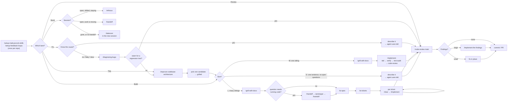

# The Vibe workflow

A solo developer's path through this repo's skills. One person, one agent, one codebase, no team process to keep happy. The goal is to keep the speed of vibe coding while removing its two failure modes: the agent built the wrong thing, and the codebase turned to mud before you noticed.

The whole workflow is **four lanes** and **one setup step**. You are always in exactly one lane. `/vibe` puts you in it and names the next command; this file is the map it reads from. The same map as a one-page poster: [docs/engineering/vibe-workflow-poster.png](../../../docs/engineering/vibe-workflow-poster.png).

Before setup or sizing, `/tell-a-story` can align a product experience you cannot yet describe. It is an optional Build on-ramp, not a fifth lane.

```
                    once per repo:  /setup-matt-pocock-skills, /setup-feedback-loops
                                        │
        ┌───────────────┬───────────────┼───────────────┬───────────────┐
        ▼               ▼               ▼               ▼               ▼
      BUILD            FIX            REVIEW           TIDY          (STUCK)
   idea → code    something broke   before merge   every few days   any time:
                                                                    /refocus
                                                                    /handoff
                                                                    /takeover
```



## Setup, once per repo

Before building or publishing work in a new repo, run `/setup-matt-pocock-skills`. Storytelling with `/tell-a-story` can happen before this setup. Three answers:

| Question | Solo default | Switch when |
| --- | --- | --- |
| Issue tracker | **Local markdown** (`.scratch/<feature>/`) | The project is on GitHub and you want issues, blocking links, and a PR trail: pick **GitHub**. Both are first-class; only the shape of the tickets changes |
| Triage labels | Accept defaults | Never, for solo work. `triage` is not in this kit |
| Domain docs | Single context (`CONTEXT.md` + `docs/adr/`) | Only a real monorepo |

It writes `docs/agents/*.md` and an `## Agent skills` block into your `CLAUDE.md` / `AGENTS.md`. The tracker-dependent engineering steps below read those files, so configure them before publishing or implementing work. Product stories and local product drafts do not need them.

Then, in the same sitting:

```
/setup-feedback-loops
```

It audits what the repo already has (and whether it is silent: a test script that finds no tests, a typecheck with `strict` off), proposes the gaps in one table, wires them (`typecheck`, `lint`, `test`, `test:file`, `format:check`, `smoke`, `dev:log`, a browser for web apps, a pre-commit guardrail), and then **proves every loop goes red** on a deliberate fault before writing the commands to `docs/agents/feedback-loops.md`. Every lane below spends those loops: `tdd` runs the tests, `implement` runs the typecheck, `verify` boots the app, `diagnosing-bugs` reads the logs. A repo without them turns every skill into a guess. Re-run it when the stack changes.

Two optional setup steps, both hooks rather than skills, both worth the two minutes:

- **Git guardrails.** On Claude Code, run the `git-guardrails-claude-code` skill from the `misc/` bucket once, global scope. It installs a hook that blocks `git push`, `reset --hard`, `clean -f`, `branch -D`, `checkout .` and `restore .` before they run. An agent that is "cleaning up" after a failed attempt is the most common way a solo developer loses an hour of their own edits. Other harnesses: use their sandbox or approval policy for the same list.
- **Pre-commit.** `/setup-feedback-loops` already proposes a guardrail; on Node it uses the `setup-pre-commit` (`misc/`) shape. Run that one directly only if you skipped the loops.

## First run

Trying the workflow for the first time, on a small project, new or existing. This is the shortest sequence that exercises every loop once. `/vibe` hands it back as a card when it finds a repo that has never been set up, and can stay in the session to check each step's output with you.

| Step | Type | It's working if | It's broken if |
| --- | --- | --- | --- |
| 1 | `/setup-matt-pocock-skills` (Local markdown) | `docs/agents/issue-tracker.md` and `domain.md` exist; `CLAUDE.md` has an `## Agent skills` block | It asked about triage labels at length, or wrote nothing |
| 2 | `/setup-feedback-loops` | You saw **every** loop go red on a deliberate fault before it was declared wired; `docs/agents/feedback-loops.md` has a duration beside each command | It declared a loop done on a green run; a "present" test script that runs zero tests was left alone |
| 3 | `/vibe <a small feature>` | One route card: lane, size, next command, context rule. It stopped | It started grilling or coding; it said `/vibe` or another skill "isn't installed" (it is; type the command anyway) |
| 4 | `/grill-with-docs` | Numbered rounds, a recommended answer per question, and `CONTEXT.md` gaining terms as you go | A single wall of questions, or it started building before you confirmed |
| 5 | `/implement` | Each `tdd` slice red then green; `verify` produced a screenshot or captured output per criterion; `test-audit` produced a **Claims** list you can read as business rules and a mutant table; a **Checks run** block at the end; the ticket's `Status:` is `done` | "Tests pass" with no evidence; a claims list full of variable names; `git diff` not clean after the mutation probe; the ticket still says `ready-for-agent` |
| 6 | Mid-`implement`, say "you forgot we agreed X", then `/refocus` | A one-screen brief quoting the spec and your words from disk; drift named with a hunk; it waited for you | A summary from memory; it kept working |
| 7 | Introduce a bug on purpose, then `/diagnosing-bugs` | It refused to theorise until one command went red; ranked hypotheses shown to you before testing | It guessed a cause from reading code |
| 8 | Next day, `/vibe` with no argument | A where-you-were block first: branch, tickets with status, last commits, next ticket | It asked the lane question cold |
| 9 | Close a window mid-ticket without a handoff, export or locate its record, open a fresh window, `/takeover <record>` | A short description of where you were (goal, what changed, where it stopped, next step), one confirmation question, nothing edited until you answer | A questionnaire; it started coding before you confirmed; it "found" edits that aren't in the repo and didn't say so |

Optional step 0, before any of it: `/askcat`. It reads the skills you have installed and writes one HTML page where a cat explains each one; keep it open in a tab while you walk the nine steps. It's working if the page lists the same skills the installer wrote and every command on it is one you can type; it's broken if it describes skills from memory that aren't installed.

Two things to check by hand after step 5: `git status` is clean (the mutation probe left nothing), and the ticket file under `.scratch/<feature>/issues/` has `Status: done` and a `## Comments` section with the commit sha.

Write down every place the agent did the "broken if" thing. That list is the first input to `retro`, and to whoever maintains these skills.

## The kit

Twenty-six skills. Fifteen you type, eleven the agent reaches for on its own (and you can type too). [ROUTES.md](ROUTES.md) accounts for every promoted skill, including the ones deliberately outside this kit; the repository check catches new skills that have no routing guidance.

**You type these** (user-invoked):

| Skill | One line |
| --- | --- |
| `/vibe` | The dispatcher: picks the lane, sizes the work, names the next command |
| `/setup-matt-pocock-skills` | Once per repo: tracker, labels, domain docs |
| `/setup-feedback-loops` | Once per repo: typecheck, lint, tests, smoke, logs, browser, guardrail, each proven red |
| `/tell-a-story` | Product alignment through a story: 1 you tell, 2 the agent tells from the workspace. Revise together, confirm, then optionally draft a product SPEC or BACKLOG. Works before setup |
| `/grill-with-docs` | The interview. Sharpens the idea, writes `CONTEXT.md` and ADRs as you go |
| `/to-spec` | Synthesises the conversation into a spec. No new questions |
| `/to-tickets` | Cuts the spec into tracer-bullet tickets with blocking edges |
| `/cattytest` | Everything is green and it still doesn't do what you asked. One scope question, then a grill from your side of the screen: what had to be true afterwards, how each gate can pass while that's missing, what a person does step by step, what evidence shows it. Ends in a test-cases sheet; `verify` walks it. Cases, not gates: `tdd` is untouched |
| `/implement` | Builds one ticket or spec: `tdd` inside, `verify` and `test-audit` when green, `code-review` at the end, commits, ends with a Checks run ledger |
| `/improve-codebase-architecture` | Surveys for shallow modules, HTML report, grills you through the one you pick |
| `/refocus` | Long session, agent drifting: re-reads the spec and every decision from disk, checks the diff against them, reports drift, asks one round about anything ambiguous, writes the answers back to the spec |
| `/handoff` | The outgoing session writes a portable file, when the work moves directory, harness, or forks a side task. The bridge out to a prototype and back |
| `/takeover` | The incoming session rebuilds context from a record (ID, export, URL, handoff file) when the old one is gone or too long to trust. Confirms before it changes anything |
| `/wait-what` | The agent said something you didn't follow. It re-pitches in plain words |
| `/askcat` | One HTML page where a cat explains every skill you have installed: what it does, when to type it, what a good run looks like, plus a "which one do I need?" picker. The kit, taught. It works before setup; regenerate when the installed set changes |

**The agent reaches for these** (model-invoked):

| Skill | Fires when |
| --- | --- |
| `grilling` | Inside `grill-with-docs` and `improve-codebase-architecture` |
| `domain-modeling` | Inside `grill-with-docs`, whenever a term is fuzzy or a decision is hard to reverse |
| `tdd` | Any time you ask for a behaviour or a fix: red, then green |
| `verify` | End of every `implement`, after the suite is green: boots the app and walks the acceptance criteria with evidence. Or when you say "does it actually work" |
| `test-audit` | After `verify` in every `implement`: renders the tests as business claims you can read, maps them to the criteria, probes with mutants. Or when you say "are these tests real" |
| `code-review` | End of every `implement`, or when you say "review since main" |
| `security-review` | Inside `code-review` whenever the diff touches a route, auth, a query, env, or a dependency. Or before anything goes on the internet |
| `research` | A library or API question that needs the real docs, not the agent's memory of them. Runs in the background and leaves a cited file |
| `diagnosing-bugs` | You say "debug", "broken", "flaky", "slow", or `/diagnosing-bugs` |
| `codebase-design` | Whenever module shape is in question: pulled in by `tdd` and `improve-codebase-architecture` |
| `prototype` | A design question that needs running code to settle: a state model you have to feel, two UIs you have to see. Lives on a `prototype/<name>` branch; the answer folds into the grill or the spec |

**Deliberately left out**, with the moment to bring each one back:

| Skill | Why it's out | Bring it back when |
| --- | --- | --- |
| `ask-matt` | The full map, not the smaller solo kit | The work involves a team or a situation this kit deliberately leaves out |
| `wayfinder` | Dense multi-session planning for efforts too foggy for one head | You start a greenfield product, or you're splitting a grown project into packages (see *When the project gets big*) |
| `triage` | Processes issues *other people* filed | You have users filing bugs |
| `to-questionnaire` | Extracts answers from someone else's head | A stakeholder appears |
| `wizard` | Scripts human-only steps (credentials, dashboards) | A deploy or cutover you'll repeat |
| `resolving-merge-conflicts` | Only useful mid-conflict | You're mid-conflict. Type it then |
| `retro` (in-progress) | Beta, not in the plugin | The same finding shows up twice: see *The loop that improves the loop* |
| `teach`, `writing-for-agents`, `grill-me` | Not code work; `grill-me` is `grill-with-docs` without the repo. `askcat` is `teach` pointed at this kit, and it *is* in | Never, inside a repo |

## Choose the question before the command

A similar phrase can mean a different job. The dispatcher and Askcat's picker use these boundaries, not a keyword race:

| What is missing? | Next skill |
| --- | --- |
| A shared picture of the product experience | `/tell-a-story` |
| Cases that would prove the agreed experience | `/cattytest` |
| Evidence from running already-agreed cases | `verify` |
| Confidence in what the existing tests claim or detect | `test-audit` |
| Facts about a library or API | `research`, which is part of the kit |
| A route through decisions too large for one session | `/wayfinder`, for greenfield work as well as a project split |

An explicit command takes precedence. If the intention is still ambiguous, one considerate clarification is better than launching several flows. A guide, story, clarification, or session-recovery request is handled before setup checks. Setup is a prerequisite for the work that needs its files, not a toll booth in front of every conversation. User-invoked skills remain yours to type.

## Lane 1: BUILD

You have an idea. Once the intended experience is shared, the decision that matters is **size**, because size decides how much ceremony you pay for. If that experience is still hard to describe, take the story on-ramp below first. Otherwise answer these in order; the first yes wins.

| Ask yourself | Size | Ceremony |
| --- | --- | --- |
| Can I write the whole change as one sentence with no open questions? | **S** | None. Say it. |
| Will it fit in one sitting and one context window, but I have questions to settle first? | **M** | Grill, then build, same window |
| Neither: it spans sittings, or I'll forget the decisions by tomorrow | **L** | Grill, spec, tickets, one fresh window per ticket |

Most vibe-coding sessions are S or M. Reach for L when you notice yourself re-explaining the same decision to the agent in a second session; that is the cost L exists to remove.

### Before sizing: tell a story

You know how you want using the product to feel, but not how to write requirements. Or there is already code, and you want to know whether it describes the product in your head. **`/tell-a-story`** starts with a choice: **1**, you tell the agent a user journey; **2**, the agent reads the workspace and tells you one. It uses concrete scenes and everyday analogies, keeps source-supported behavior separate from uncertainty and desired changes, and asks one focused question at a time. Correct the scenes for as many rounds as needed.

Confirm the latest story before it becomes requirements. Then choose a product **SPEC**, a proposed **BACKLOG**, both, or just the story. Saved conversions include `story.md`; backlog items are drafts under `backlog/`, not live issues under `issues/`. No technical-stack choice, issue publication, or implementation happens here, and no setup is needed to begin.

Carry that agreement into `/grill-with-docs` if design decisions remain, or into `/to-spec` and `/to-tickets` when ready to prepare execution work. The story is an input, not a reason to skip technical planning or its acceptance checks. Set up the tracker before publishing work and the feedback loops before building it. A huge set of unresolved decisions still belongs in `/wayfinder`; proof of an already-agreed experience belongs in `/cattytest`.

### S: the one-liner

Type what you want. Because `tdd` is model-invoked, a well-behaved agent will write the failing test first; if it doesn't, say "test first". If it's user-facing, add "then verify it" so it boots the app and shows you rather than telling you. Finish with `/code-review main` if it touched more than one file.

> Add a `--json` flag to the export command that prints the same rows as JSON. Test first.

### M: grill, then build in the same window

1. **`/grill-with-docs`** and describe the idea in two or three sentences. It comes back with a numbered round of questions, each with a recommended answer. Answer them (accepting the recommendation is a fine answer). Rounds continue until the frontier is empty. It will update `CONTEXT.md` and offer ADRs as decisions crystallise; take the ADRs for anything you'd otherwise re-argue next month.
2. **Stay in the same window.** The implementation wants the reasoning verbatim, not a summary of it.
3. **`/implement`**. It confirms the seams it will test at, drives `tdd` slice by slice, runs typechecks and single test files as it goes, the full suite once at the end. Then **`verify`** boots the thing and walks each acceptance criterion as a user would, with a screenshot or captured output per row; a FAIL goes back into the `tdd` loop before anything else happens. Then **`test-audit`** renders every test as a one-line business claim, maps the claims to your criteria, and breaks the logic on purpose a dozen times to see which rules no test protects; survivors and uncovered rows go back into `tdd` too. Then `code-review`, then commit, then a **Checks run** block listing exactly what was checked.

**Read the claims list.** It is the one place in the whole workflow where a wrong business rule is visible to you before it ships: the test and the code can agree with each other and both be wrong, and no tool catches that. You can.
4. Read the review's two axes (Standards, Spec). Fix in place.

If the implementation runs long and the agent seems to have lost the plot (a decision from the grilling quietly reversed, scope growing), **`/refocus`**. It re-reads what you agreed and shows you the drift before you spend another hour on it.

> /grill-with-docs
> I want dark mode. System preference by default, a toggle in settings, persisted per user.

### L: grill, spec, tickets, build per ticket

Steps 1 to 3 happen in **one unbroken window**. Don't `/clear` or `/compact` until the tickets are written.

1. **`/grill-with-docs`** as above. If a question can't be settled by talking, take *The prototype detour* below and come back to the same window.
2. **`/to-spec`**. No new questions. It proposes the **seams** it will test at (fewer is better, one is ideal) and asks you to confirm them, then writes `spec.md` to the tracker with `ready-for-agent`. Read the User Stories list; it's long on purpose, and a missing story now is a missing feature later.
3. **`/to-tickets`**. It proposes vertical slices with blocking edges and asks about granularity. Each slice must be demoable on its own and fit in a fresh window. Approve, and it writes `issues/01-*.md`, `02-*.md`, … in dependency order.
4. **Per ticket**: `/clear`, then `/implement .scratch/<feature>/issues/NN-<slug>.md` (or the GitHub issue number). Work the frontier: any ticket whose blockers are done. Each run ends with its own `code-review` and commit. If a single ticket runs long enough that the agent starts forgetting the ticket's own criteria, `/refocus` before you do anything else.
5. When the last ticket lands, **`test-audit`** across the whole feature (per-ticket audits can't see a user story that fell between two tickets), then **`/code-review main`** across the whole branch once, because per-ticket reviews can't see cross-ticket smells (Duplicated Code across slices is the usual one).

### Halfway in: green, and not what you wanted

The feature was "pick the apple off the tree". The code is clean, the gates are green, and the apple is on the tree. It happens because every test the agent writes for itself checks what the agent *understood*; when the understanding is the bug, they all pass. Don't ask the agent to "add more tests": it will add more of the same kind. **`/cattytest`** instead. One scope question (this feature or the whole product), then a grill from your side of the screen: what had to be true in the world afterwards, how each existing gate can be green while that's missing, what a person does step by step, with which real data, and what artefact shows the apple in the basket. It ends in a `test-cases.md`: numbered cases in your words, each with a runner (`verify`, you by hand, or automated). Say go and **`verify`** walks the sheet against what's built; expect a FAIL, that's the apple. Each FAIL goes back into `tdd` as a red test, the way it always has, and from there the feature is back on the M path. The sheet stays with the ticket; `verify` at the end of every later `implement` walks it again.

### The prototype detour

Some grill questions have no answer on paper: whether a state model feels right once you click through it, which of two layouts reads better, whether a library actually behaves the way its README says. Arguing them in the interview burns the window and settles nothing. The detour is a fixed four-step round trip, and it works from M as well as L:

1. **`/handoff`** with the question as the argument ("prototype the draft/published/archived transitions; is a separate `scheduled` state needed?"). It writes a small file with the decisions so far and the question. The grill window stays open; don't close it.
2. Fresh session (a scratch directory or the same repo, your choice): point it at the handoff file and say **`prototype`**. It picks the shape from the question: a single HTML file you can click for state and logic, or several deliberately different UI variants on one route for a design choice. Throwaway is a rule about how the code is written, not what happens to it: the prototype is committed on a `prototype/<name>` branch, never merged, and stays as a primary source.
3. Look at it. Decide. Write the decision down in one or two sentences; the prototype session can `/handoff` them back, or you just carry them.
4. Back in the grill window: "prototype settled it: <decision>, see branch `prototype/<name>`". The grill records it in `CONTEXT.md` or an ADR and the frontier moves on. `to-spec` will point the spec at the branch.

If the grill window died while you were away (it happens: quota, a sleep, a crash), don't re-grill. `/takeover` its record in a new window, confirm the summary, and continue from step 4.

## Lane 2: FIX

Something is broken. The split is whether you already know why.

| You | Do |
| --- | --- |
| Know the cause | Say it. The agent uses `tdd`: failing test that reproduces it, then the fix. Then `/code-review main` |
| Don't know, or it's intermittent, or it's a slowdown | `/diagnosing-bugs` |

`diagnosing-bugs` is gated. **Phase 1 is a feedback loop**: one command that goes red on *this* bug. It refuses to theorise until it has one, and that refusal is the feature. Give it whatever repro you have (the error text, the request, the steps). Then:

- Phase 2 reproduces and minimises.
- Phase 3 shows you 3 to 5 ranked hypotheses **before testing any**. This is your one cheap checkpoint: if you know one is wrong ("we didn't touch that"), say so.
- Phase 4 instruments with tagged logs (`[DEBUG-xxxx]`), one variable at a time.
- Phase 5 writes the regression test before the fix, **if a correct seam exists**. If it reports that no seam exists, that's a TIDY-lane finding: the architecture is preventing the bug from being locked down. Take it to `/improve-codebase-architecture` pointed at that module.
- Phase 6 cleans up and states the confirmed hypothesis in the commit message.

> /diagnosing-bugs
> Login sometimes returns 401 right after signup. Maybe one in ten. Here's the response body: …

## Lane 3: REVIEW

Before anything merges, and at the end of every L build:

```
/code-review main
```

(Or whatever the fixed point is: a SHA, a tag, `HEAD~5`.) It runs two subagents in parallel and reports them side by side:

- **Standards**: your documented coding standards, plus a Fowler smell baseline (Duplicated Code, Feature Envy, Speculative Generality, …). Baseline smells are judgement calls; documented-standard breaches can be hard.
- **Spec**: what the originating issue asked for, versus what landed. Missing, extra (scope creep), or wrong.

- **Security**, when the diff touches a route, auth, a query, env, or a dependency: the five failures solo-built apps actually ship (secrets in the bundle, routes without per-record authorisation, unvalidated input, data access that bypasses RLS, unaudited dependencies). A `block` here is stated first, because nothing ships past it. Run it on its own, `security-review` against `main`, before the first time anything faces the internet.

It never picks a single winner across the axes, on purpose. Read all of them. Small findings: fix in the same window. A pile of findings: paste them into `/implement`.

If you open a PR, the in-progress `pr` skill gives the body a shape (summary from the spec, before/after evidence, one-way or two-way door). Install it separately: `npx skills@latest add mattpocock/skills --skill=pr`.

## Lane 4: TIDY

Every few days, or whenever FIX reported "no seam", or whenever you feel the agent bouncing between too many small files to understand one thing:

```
/improve-codebase-architecture
```

Point it at a hot spot if you have one ("the sync module"); otherwise it reads `git log` and follows the churn. It writes an HTML report to your temp directory with before/after diagrams per candidate, each badged `Strong` / `Worth exploring` / `Speculative`, and a top recommendation. It proposes no interfaces yet.

Pick one. It grills you through the deepened module's shape, updates `CONTEXT.md` with any new term, and offers an ADR if you reject a candidate for a reason future-you needs to remember.

What comes out is **an idea**. Size it and put it back on the BUILD lane: usually M (`/implement` right there, the grilling already happened) or L (`/to-spec` → `/to-tickets` when it's a wide refactor, which `to-tickets` sequences as expand → migrate → contract).

The other TIDY tool is the vocabulary itself. When `CONTEXT.md` has a word doing two jobs, or the agent keeps using twenty words for a concept you'd name in one, ask for `domain-modeling` directly.

Docs drift too. `refocus` checks the code against the spec mid-session, but nothing checks the other direction over months: whether `CONTEXT.md`, the ADRs, and the closed specs still describe the code that exists after twenty bug fixes. Every few weeks, in the same sitting as the architecture survey, ask `domain-modeling` to reconcile `CONTEXT.md` against the code: terms with no code behind them, code concepts with no term, ADRs the code has quietly overturned. A stale glossary is worse than none, because every skill trusts it.

## When it keeps coming out wrong

You asked for a change, it came back wrong, you said "still wrong", and you are three or four attempts in. Stop. "Keeps coming out wrong" is not a bug symptom; it is the symptom of nobody having said what **right** is in a form that can be checked. Four different root causes produce it, and each has its own lane. Repeating "try again" in the same window is the one move that helps none of them: every failed attempt stays in context and the agent starts changing things at random.

First, throw the attempts away (`git stash` or `git checkout .`), `/clear`, and write **one concrete example**:

> When the input is ___, I expect ___, but I get ___.

Then route on whether you could write it:

| Could you write the example? | Root cause | Lane |
| --- | --- | --- |
| No, or writing it showed you aren't sure what you expect | The agent's "right" and yours differ. Every version may have been correct for a spec that isn't yours | `/refocus` if the feature has a spec or ticket; `/grill-with-docs` if it was never pinned down |
| Yes, and a failing test for it goes green after one fix | There was no feedback loop; the agent was flying blind and reporting imagined results | Say "write a test for this example, watch it fail, then fix it. No code before red." That is `tdd` |
| Yes, the test stays red, or greening it turns something else red | A real bug underneath the feature | `/diagnosing-bugs`, with the failing test as its Phase 1 loop |
| Yes, but every attempt touches five files and fixing A breaks B | No seam. The architecture is preventing the change from landing cleanly | `/improve-codebase-architecture` pointed at the module |

The example is the whole trick. It is the smallest possible feedback loop, and `diagnosing-bugs` Phase 1 says the same thing in more words: no command that goes red, no theorising.

## Context rules

These rules cover nearly every session. The full decision tree is in `ask-matt`'s `PHASE-BOUNDARIES.md`; these are the cases a solo developer actually hits. `/clear` and `/compact` are written the Claude Code way; read them as whatever your agent calls starting a fresh window and compressing the current one (Codex: `/new` and `/compact`).

| Situation | Do |
| --- | --- |
| Story → design decisions → spec → tickets | **Stay.** Keep the agreed scenes and corrections available; saved product drafts are the source if the work resumes later |
| Grill → spec → tickets | **Stay.** One window, no compacting. The spec needs the reasoning verbatim |
| Grill → implement (M) | **Stay.** Same reason |
| Between tickets (L) | **`/clear`.** Each ticket is self-contained; the last one's context is disposable |
| Moving to another directory or harness, or forking a side task mid-phase | **`/handoff`.** It buys portability and nothing else; if nothing is travelling, you don't need it |
| Long session, the agent forgot a decision, widened scope, or is working the wrong criterion | **`/refocus`.** It re-reads the spec, ticket, `CONTEXT.md` and your mid-session decisions from disk, diffs them against the work, and reports dropped / drifted / contradicted items. Where the sources are ambiguous it asks one round of questions with recommended answers, and writes your answers back to the ticket. Same window. Run it *before* you compact |
| Long session, relevant context, same place, and refocus said the window is nearly spent | **`/compact`** seeded with the refocus brief: `/compact continue from /tmp/refocus-<ts>.md`. Last resort, not first |
| The old session is gone (quota, crash, closed window, another tool) and nobody wrote a handoff | **`/takeover`** in the new session, with the export, ID, or URL. It indexes the record, rebuilds goal / constraints / turning points / stopping point / next step, maps old paths onto this checkout, describes it in at most ten sentences, and asks once. Read-only until you confirm |
| A handoff file exists and you are the session that continues it | **`/takeover <path>`** rather than "read this and go". Same confirmation step; the handoff's claims ("X is done") get checked against the repo instead of inherited |

The three that touch a session's *identity* are easy to mix up, so, side by side:

| | `/refocus` | `/handoff` | `/takeover` |
| --- | --- | --- | --- |
| Session is | Open, drifting | Open, about to move | Gone, or not to be trusted |
| Who does the work | This session, from disk | The outgoing session writes | The incoming session reads |
| Produces | A drift brief, answers written to the ticket | A portable file in temp | A confirmed summary, optionally a revised SPEC |
| You stay in the window | Yes | The old one, if you are forking | New window, by definition |

And one rule about the agent's words rather than its context: the moment a message doesn't land, **`/wait-what`**. It re-pitches with the context you were missing, in your `CONTEXT.md` vocabulary. Don't nod along; a misunderstanding here becomes a wrong spec three steps later.

## When the project gets big

Months in, the agent has to read half the repo to change anything, one change ripples into five directories, and `CONTEXT.md` has words from three different worlds in it. The instinct is "split it into several projects". Split the word first.

| | Logical split | Physical split |
| --- | --- | --- |
| What it is | One repo, several packages, boundaries enforced by tooling, one `CONTEXT.md` per package | Several repos |
| What it fixes | The agent reads less, changes stop rippling, vocabulary stops colliding | Different deploy cadence or runtime; a library published for others; a different language toolchain; a security boundary |
| Solo | **Almost always the one you want** | Usually makes things worse: two PRs per cross-cutting change, version numbers to manage, an agent that can't see the other side |

Do the logical split. Do the physical one only when one of the four conditions in the right column is true, and only after the logical split has proved the boundary is in the right place.

The logical split is a chain through skills you already have, plus two you bring back for it:

1. **Where to cut.** `/improve-codebase-architecture`, told explicitly to look for *package boundaries* rather than modules to deepen, and `domain-modeling` to name each context. The evidence you want is co-change (files that always change together belong together; two areas that never change together but import each other have a seam between them), the size of the interface each cut would need (smaller is righter), and which `CONTEXT.md` terms live in which directories. Ask for that analysis by name; the survey doesn't do it unprompted.
2. **Deciding the whole thing.** This is dozens of decisions (what goes where, what's shared, what's the dependency direction, what happens to the tests) and no single window holds them. This is the moment to bring back **`/wayfinder`**: it charts the decisions as a map and resolves them one at a time, and hands off to `/to-spec` when the way is clear.
3. **Executing.** `/to-spec` → `/to-tickets`. A split is a series of wide refactors, and `to-tickets` sequences those as **expand → migrate in batches → contract**, each batch its own ticket, CI green between batches. Then `/implement` per ticket as usual.
4. **Making the boundary real.** A boundary nobody enforces doesn't exist; the agent will deep-import across it the first time a ticket is running late. On TypeScript, `setup-ts-deep-modules` (in-progress bucket) installs dependency-cruiser rules: outside code imports a package's entry points only, never its subfolders, no cycles. Other stacks: the equivalent import linter, wired into the pre-commit hook.
5. **Docs follow the shape.** Re-run `/setup-matt-pocock-skills` and pick multi-context: a root `CONTEXT-MAP.md` pointing at one `CONTEXT.md` (and one `docs/adr/`) per package. Every skill in the kit reads the map from then on.

Step 4 is the one people skip and the one that decides whether the split holds.

## Git in this workflow

No skill runs your git for you; the rules are few enough to be conventions. Put the block at the end of this section in your project's `CLAUDE.md` so the agent follows them without being told each time.

| Rule | Why |
| --- | --- |
| **S builds commit on `main`. M and L builds get a branch** (`feat/<slug>`), created *before* `/grill-with-docs`, and every ticket of an L build lands on that same branch | `implement` commits to whatever branch you're on. Type it on `main` and that's where the work goes |
| **The tree is clean before every `/implement`** and every `/diagnosing-bugs` | The "keeps coming out wrong" recovery is `git stash` back to the last good commit. That only works if there is one |
| **One green slice, one commit.** `implement` already does this through `tdd`; when you're working without it, ask for it | Small commits are the undo buffer. An hour of uncommitted agent work has no undo |
| **The agent never runs destructive git.** No `push --force`, `reset --hard`, `checkout .`, `clean`, `branch -D`. It asks; you run it | Enforced by the guardrails hook, not by trust |
| **Merge when `/code-review main` is clean.** Solo, a fast-forward or squash merge is fine; open a PR when you want the diff as a record, and let the `pr` skill write the body | Review is the gate, not the PR |
| **Prototype branches stay out of `main`** (`prototype/<name>`), referenced from the spec | `prototype` does this itself; don't merge them "to keep the code" |
| **Commit messages name the why.** For a bug fix, the confirmed hypothesis; for a ticket, the ticket id | `diagnosing-bugs` Phase 6 requires it; the next debugger (you, in a month) reads it |

The conventions block:

```markdown
## Git

- S-sized changes commit on `main`. Anything that starts with `/grill-with-docs` gets a `feat/<slug>` branch first; all of that feature's tickets land on it.
- Never run `git push --force`, `reset --hard`, `checkout .`, `restore .`, `clean`, or `branch -D`. Ask, and I'll run it.
- Commit after every green test slice. Message: what changed and why; for a bug fix, the confirmed cause; for a ticket, its id.
- Before starting `/implement` or `/diagnosing-bugs`, confirm `git status` is clean. If it isn't, ask me whether to commit or stash.
- Prototype code goes on `prototype/<name>`, never merged.
```

If you get into a real mess anyway (the agent "tidied" the tree, or a rebase went sideways), the tools are `git reflog` for anything that was ever committed, `git stash list` for anything stashed, and `resolving-merge-conflicts` for an in-progress conflict. Ask the agent to *show* you the recovery plan before it runs any of it.

## The loop that improves the loop

Everything above closes on the *product*: a wrong claim goes back to the spec, a surviving mutant goes back to `tdd`, a review finding goes back to `implement`, a "no seam" goes to the architecture survey. One loop is still open: the one that closes on the *environment*. When `test-audit` flags the same tautological pattern for the third time, when `code-review` keeps citing a rule that a linter could enforce, when a session lost an hour finding a file, the lesson has nowhere standing to go.

`retro` is that step. It lives in the `in-progress` bucket (beta; install it with `npx skills@latest add mattpocock/skills --skill=retro`), and it reads a session for exactly these: a check that should exist, a rule that belongs in `CODING_STANDARDS.md`, a navigation pointer for `CLAUDE.md`, an instruction that does nothing. Its one discipline worth knowing in advance: a **mechanical** repeat (a banned pattern, an import shape, a file location) becomes a deterministic check, wired through `/setup-feedback-loops`, and only a genuine judgement call becomes prose for the reviewer.

Run it after a rough session, or whenever the same finding shows up twice. It closes the last loop: the workflow that just ran becomes the reason the next run is better.

## What accumulates in the repo

After a few weeks the workflow leaves this behind. All of it is what makes the agent sharper in session twenty than in session one.

```
CONTEXT.md                          the shared language (glossary + relationships)
docs/adr/NNNN-*.md                  decisions you don't want re-argued
docs/agents/issue-tracker.md        where issues live (written by setup)
docs/agents/domain.md               how to read the domain docs (written by setup)
docs/agents/feedback-loops.md       the check commands and their timings (written by setup-feedback-loops)
.scratch/<feature>/story.md         the approved product story, when used
.scratch/<feature>/spec.md          a product draft or L build spec; check its status
.scratch/<feature>/backlog.md       proposed work index, before tracked issues
.scratch/<feature>/backlog/NN-*.md  draft work items, not an execution queue
.scratch/<feature>/issues/NN-*.md   published local tracker issues
```

Commit `CONTEXT.md`, `docs/`, and `.scratch/` (it is the paper trail; `to-spec` and `implement` read it). Keep `prototype/*` branches out of `main`.

## Two sessions, end to end

**A Tuesday feature (M).** "Notes should support tags." `/grill-with-docs`: round one asks whether tags are free text or a fixed set, per-note or per-user, and whether filtering is in scope (recommended: free text, per-user, filter yes). Round two asks about case sensitivity and a max count. `CONTEXT.md` gains **Tag** and the rule that tags are case-insensitive; an ADR records why they're per-user, not global. `/implement`: it names two seams (the notes repository and the `/notes?tag=` route), you nod, it builds four red-green slices, `verify` boots the app and walks the four criteria with a screenshot each (the tag filter passes, the empty-tag wrong path returns a 400 as it should), `test-audit` lists six claims (you read them; number 4, "a note can have at most ten tags", is wrong, the limit you agreed was twenty, and both the test and the code had ten), one mutant survives on the case-insensitive compare, and the review flags one Data Clump (tag name + colour travelling together) and one missing user story (removing a tag). You fix all of it, it commits, and the Checks run block tells you what ran. Fifty minutes.

**A Thursday bug (FIX, hard).** "Export is slow since last week." `/diagnosing-bugs` builds a timing harness against a fixture of 5,000 rows, baseline 12 seconds, bisects to the commit that added the tag filter, and shows you three hypotheses ranked with an N+1 on tags at the top. You confirm. It writes a regression test asserting one query per export at the repository seam, watches it fail, fixes it, 0.4 seconds, cleans the `[DEBUG-7c1e]` lines, and commits with the hypothesis in the message. The seam existed because Tuesday's `implement` tested at the repository. That is the workflow paying for itself.

## Cheatsheet

| I want to… | Type |
| --- | --- |
| Not think about any of this, or remember where I was | `/vibe` |
| Try the whole workflow once on a small project | `/vibe` in a fresh repo; it hands back the *First run* sequence and checks each step with you |
| Set up a new repo | `/setup-matt-pocock-skills`, then `/setup-feedback-loops` |
| Describe the product I want, or hear what using this workspace would be like | `/tell-a-story`: choose 1 to tell, 2 to listen; agree the story before optional SPEC / BACKLOG drafts |
| Build something small | Just say it (add "test first") |
| Build something with open questions | `/grill-with-docs` → `/implement` |
| Build something big | `/grill-with-docs` → `/to-spec` → `/to-tickets` → per ticket `/clear` + `/implement` |
| Fix a bug I understand | Say it (add "test first") |
| Fix a bug I don't | `/diagnosing-bugs` |
| See it actually work | `verify` (automatic at the end of `/implement`; say "verify it" any other time) |
| It's green and still not what I wanted; design the tests that check *that* | `/cattytest`, then `verify` on the sheet |
| Know what the tests actually check, and whether they can fail | `test-audit` (automatic in `/implement`; run it on the whole feature before merge) |
| Check the branch | `/code-review main` |
| Check before it goes public | `security-review` against `main` |
| Which library / how does this API work now | `research` |
| Check the architecture | `/improve-codebase-architecture` |
| Get the agent back on track after a long session | `/refocus` |
| Same mistake keeps happening across sessions | `retro` (in-progress bucket): turn it into a check or a standing rule |
| Split a project that's grown too big | Logical split first: see *When the project gets big*; bring back `/wayfinder` for the decisions |
| It's come back wrong three times | Stop. Write "input / expected / actual", then route (see *When it keeps coming out wrong*) |
| A question only running code can answer | The prototype detour: `/handoff` → `prototype` in a fresh session → the decision comes back |
| Move to another repo / tool, or fork a side task | `/handoff` |
| The old session died, ran out of quota, or is too long to trust | `/takeover <export / ID / URL / handoff file>` in a fresh session |
| Understand what it just said | `/wait-what` |
| Have the whole kit explained to me on one page, in my language | `/askcat` |
